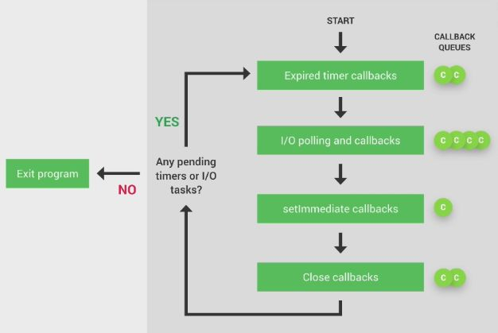
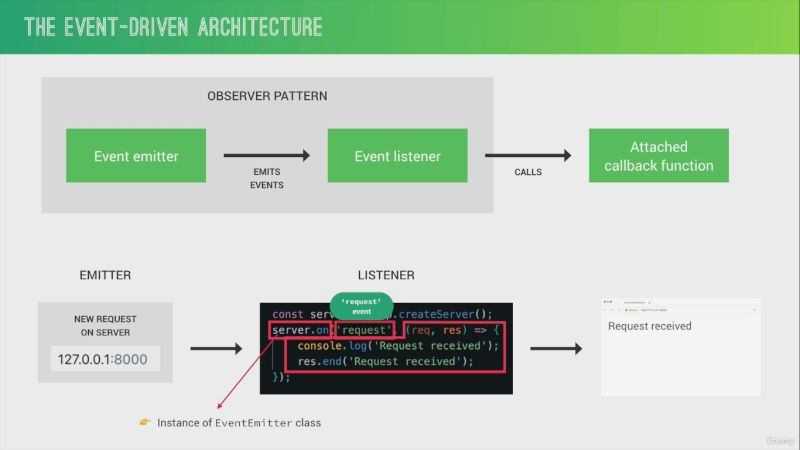
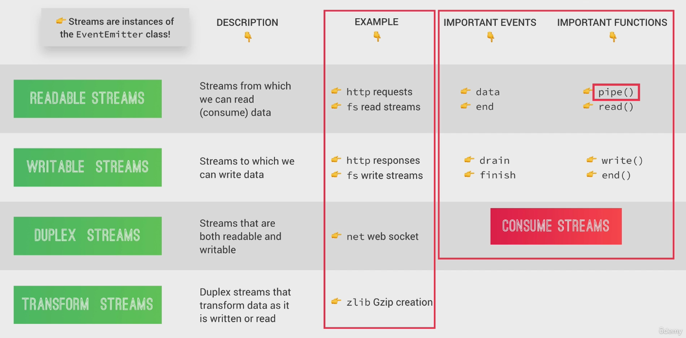
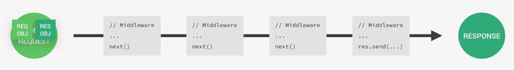

## Tutor: Jonas_Schmedtmann

_Github_: [Repository](https://github.com/jonasschmedtmann/complete-node-bootcamp)

_NB:_ Using NodeJS [v22.20 LTS](https://nodejs.org/en/download)

### Chapter 2:

- [File system node document](https://nodejs.org/docs/latest-v22.x/api/fs.html)
- 3rd party module: [[slugify](https://www.npmjs.com/package/slugify), [nodemon](https://www.npmjs.com/package/nodemon)]
- npm package version update work _1(major).0(minor).0(patch)_ 
- How to update an outdated package & install specific package?
```
npm install slugify@1.0.0
npm outdated
```
```
"dependencies": {
    "slugify": "^1.6.6"
  },
```
> In <ins>package.json</ins> '^' means we accept all the patch & minor releases & '~' means only patch releases (safe option ~ due to only patch, major can break the code)
- How to uninstall package?
```
npm uninstall/remove express
```
- Prettier config -> [Link](https://prettier.io/docs/options)

### Chapter 3:

1. Request-Response model:
   - **<ins>https:</ins>** **<ins>//www.google.com</ins>** **<ins>/map</ins>**
   - _[Porotocol] / [Domain name] / [Resource]_

2. DNS convert link to real address like _https://google.com/maps_ to _https://216.58.211.206:433_
   - **<ins>https:</ins>** **<ins>//216.58.211.206</ins>** **<ins>:443</ins>**
   - _[Porotocol] / [IP address] / [Port number]_
   - TCP/IP socket connection established between browser & server
   - **HTTPS request**
   ```
   GET /maps HTTP/1.1 (start line: http method + request target + http version)
   
   Host: www.google.com (HTTP request headers can be many)
   User-Agent: Mozila/5.0
   Accept-Language: en-US

   <BODY> (only send data to the server)
   ```
   - What is the difference between http * https?
     - https use TLS or SSL encryption
   - HTTPS response
   ```
   HTTP/1.1 200 OK (start line: http method + status code + status message)
   
   Date: Fri, 18, Jan 2021 (HTTP response headers can be many)
   Content-Type: text/html
   Transfer-Encoding: chunked

   <BODY> (response body)
   ```


### Chapter 4:




### Chapter 5:
- [Dog api](https://dog.ceo/dog-api/documentation/)
- NPM Package: [superagent](https://www.npmjs.com/package/superagent?activeTab=readme)

### Chapter 6:
- [Express 4.21.2](https://www.npmjs.com/package/express/v/4.21.2)
- optional for typescript type
```
npm install --save-dev @types/express @types/node
```
- 
- [3rd party middleware](https://www.npmjs.com/package/morgan)
- [express doc](https://expressjs.com/en/4x/api.html)